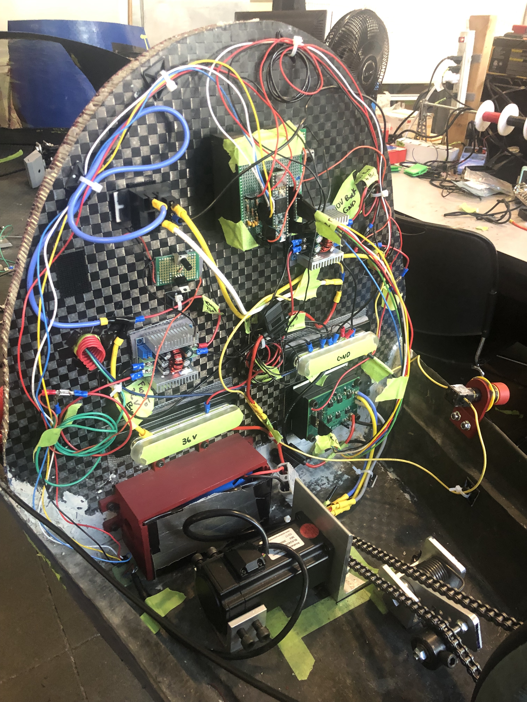

# Bruin Racing

UCLA Supermileage Vehicle

I lead the power/wiring team to design the electrical layout of the vehicle and assemble the modules (buck converters, horn, sensors, voltage regulators, etc.)

